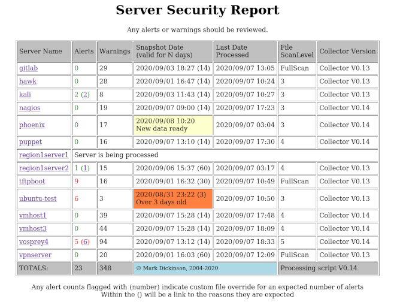

# Linux Server Audit Toolkit

These scripts Check for common security issues not normally checked on a regular basis by system administrators.

Using the scripts the checks can be automated to provide one place check results can be viewed.
Additionally automating the processing runs allows you to periodically archive the processing results (an
option of the processing script) to provide historical snapshots of things such as all cron jobs on a server
or all processes that have opened listening ports on the server.

For known exceptions customisations can be done to the checks performed on a per-server basis.
Detailed documentation on all the customisation parameters available is in the file file security-audit-doc.html.

Be warned, the fisrt run against a server will most likely find hundreds of issues to be resolved.
But it is possible to get them down to only a few.

## Table of contents
* [Requirements](#requirements)
* [Current checks performed](#current-checks-performed)
* [Processing control features](#processing-control-features)
* [Directories that must exist for processing](#directories-that-must-exist-for-processing)
* [Example install using required directories](#example-install-using-required-directories)
* [Using the scripts](#using-the-scripts)
* [Example of the main index produced from processing](#example-of-the-main-index-produced-from-processing)
* [Known issues with the current release](#known-issues-with-the-current-release)
* [Planned enhancements](#planned-enhancements)


## Requirements
* MUST have the BASH shell on all servers, the scripts use operations only available in bash 
* processing scripts must be installed under a directory path that contains no underscore ( _ ) character, that is used as a parsing delimiter
* only runs on Linux servers [tested on Fedora/CentOS/Kali/Ubuntu]
* the 'netstat' command must be available on all the servers and must support the '-p' option, for collecting information
  on tcp/tcp6/udp/udp6/raw/raw6 ports and the unix sockets open on the server and what is using them
* the 'iptables' command should be available on all servers, for checking iptables firewall rules against open ports
* the 'nft' command should be available on all servers, for checking netfilter firewall rules against open ports
* both 'dmidecode' and 'lshw' should be installed to record the server hardware details
* A LOT OF PATIENCE as a full scan of a server can produce
  well over 300,000 files to be checked which can take a
  very long time, combine that with a full processing run
  of 20-30 servers you will have to wait a few days.
  (refer to the documentation for single server processing
  and only 'updated' server processing to minimise the time
  needed) and you can of course perform limited file checking
  by using the --scanlevel on data collection scans instead of
  the default of full scans).

## Current checks performed
* filesystem checks - checks the permissions of all 'system files' to ensure
  they are only writeable by the file owner, and that all are owned by a 
  valid defined 'system' userid. System files are defined as all those
  under directories /bin /boot /dev /etc /lib /opt /sbin /sys /usr /var,
  easy to add others (search in collection script on the string
  find_perms_under_system_dir and copy/paste and existing line to
  add a new directory if needed).
* read only files checks (additional for my use) - checks all files under explicitly
  defined filesystem paths have 'read-only' permissions (for static or seldom
  changing web served pages). Filesystem paths are provided by a file selected
  with the optional collector option --webpathlist=/some/file and if not
  provided (default) data for those checks will not be collected and the
  report not produced... most users will never use this but I need it
* cron checks - check all crontab files belong to users that exist on the
  server and that the settings in cron.allow or cron.deny permit the user
  to use cron... also attempt to identify the file permissions of each
  script run by cron to ensure it is only writeable by the crontab owner
  (amazing the number of script files run by root via cron that anyone
  can update) but that does require cron is used to run scripts, crontab
  commands that are 'stacked' with a ; and start with system utilites
  such as "cd /somedir;./somecommand" will always alert as obviously
  users do not own 'cd'.
* checks for common things such as a valid motd and ssh banner existing,
  permitrootlogin set to no in the sshd config etc.
* user checks - uuids are all unique, all users have a password or
  account is locked, all user home directories exist and are secured correctly,
  report on all users that can use ftp (not in ftpusers file) and on all
  users in the ftpusers file that no longer exist on the server, check
  security of /etc/shadow, and of course checks the system default settings
  for password length and expiry.
* network connectivity checks - ensures every open port on the server is
  documented in the customisation file for the server, alerts on undocumeted
  ports. For documented ports raises warnings if the application is 
  listening on all interfaces instead of being securely configured to 
  listen only on explicit interfaces. Also alerts on any ports defined in
  the server customisation file that are no longer in use so the config 
  file can be cleaned up.
* firewall rule checks - if the server has a firewall in place will check
  (if the iptables command (or nft for netfilter servers) is on the server)
  all explicit port numbers used match ports expected to be open on the
  server as defined by the network checks, and also alert if firewall rules
  accept traffic to ports that are not in use on the server (to identify
  obsolete server firewall rules)
* optional, backs up /etc
* optional (but default) collect hardware info
* optional, if 'rpm' is available collect a installed package list

## Processing control features
* customisation files can be provided at a per-server level for known 
  exception cases; such as files that must be insecure, network ports for
  applications that just cannot be configured to specific interfaces,
  user home directories that must be insecure (ie: multiple system users
  are mapped to /bin or /sbin which must be owned by root (not by the
  system user such as adm or operator) and must be traversable by other
  users, and quite a few other customisable cases.
* runtime processing parameter to allow a single server to be re-processed as needed
* runtime processing parameter to allow automatic detection of updated collected data files and process them
* NOTE HOWEVER automatic re-processing of all servers is forced/performed if a new version of the processing script is installed

## Directories that must exist for processing

The below directory structure is expected for the processing script to work. 
If obtained using git clone the directory structures will be in place.

```
   somedir                    - the root of where you install the toolkit
   somedir/bin                 - location of the processing script (expected by example RUN file)
   somedir/custom              - place all custom files in here
   somedir/results             - all reporting results are placed here
 - the directory containing the data to be processed that was collected by the
   collect_server_details.sh script must be supplied by parameter
   (I prefer somedir/rawdatafiles)
- any result archive directory must be parameter supplied
   (I prefer somedir/archive)
```

## Example install using required directories

As this toolkit is bundled under my shell scripts package these are the steps
needed to install the toolkit and cleanup unused files.
_You cannot_ leave it in the cloned directory as the underscore in the shell_scripts
directory name will prevent the processing script running correctly.

```
cd /some/app/dir/you/use
git clone https://github.com/MarkDickinson/shell_scripts.git
cd shell_scripts/security-audit
mkdir bin custom results archive rawdatafiles
mv *sh bin
mv ALL.custom custom
cd ../..
rm README.txt common_functions.bash makepdf.bash nagios_submit_passive_update.sh
cd ..
mv shell_scripts/security-audit .
rmdir shell_scripts
```

## Using the scripts

Full details on all runtime parameters that can be passed to the scripts are 
in the file security-audit-doc.html. You should review that file as there
are many optional parameters that can be used in the commands below.

On each server to be checked run the data collection script

```
./collect_server_details.sh [--scanlevel=N]
```

The files produces by the collection script need to be copied to a directory
on the processing server. As noted in the required directories list above
I prefer this to be under the main directory in a directory named rawdatafiles.

Once you have a bunch of servers data ready to process, on the processing server

```
bin/process_server_details.sh --datadir=/where/you/put/the/server/datafiles
```

The results will be in the results directory, the toplevel is index.html.

Look at the file RUN for examples of all available processing script options.


## Example of the index produced from processing



Most fields are self explainatory, requiring a mention are the points below

* optional processing runtime parameter '--indexkernel=yes' will add an extra field to the
  index listing the kernel version reported by 'uname' on the server that was processed
  (tip: can be used in conjunction with '--indexonly=yes' to switch that extra column on/off
  without any server processing)
* if new collector data files are available they will be shown as ready to be processed
* if any server collected data files are over two weeks old they will be highlighted for easy visibility,
  as you should have automated data collection and getting it to the processing server
* the values in the server name field are links to individual server results indexes,
  which in turn have links to details on each check performed for the server

## Known issues with the current release
* cron job checks - only cron jobs are checked, not anacron files or any 'at' jobs
* cron job checks - where a cron job uses a system command (echo, cd, php) rather than
  a discrete script an alert will always be raised as system commands are normally owned
  by root and not the owner of the cron job
* user checks - system defaults for max password length and expiry checks are
  obtained from /etc/login.defs; I need to update this to also check the PAM settings
* server firewall rule checks - no attempt is made to follow firewall chains or determine zones,
  any rule to open a port is considered an open port


## Planned enhancements

These are the planned upcoming enhancements for version 0.12

* on the main index display of out-of-date collected data files make the number
  of days before alerting on old snapshots configurarable on a per server basis
  as I have some VMs only started on an as-needed basis
* check PAM password rules to see if they are different to login.defs rules
* add last logged on checks for non-privaliged accounts that are not locked
  and do not have a shell of nologin, also check users with a shell of nologin
  for last login time (as we all know having a default shell of nologin does
  not stop anyone logging in as the default shell can be overridden on commands such as 'su')
* On servers running NetworkManager on startup NetworkManager adds firewall 'accept' rules
  for ports 67 and 68 (both udp and tcp) for vibr0 even if you intend to never run
  applications on those ports (67 is dnsmasq) so these will always alert as firewall ports
  open but not in use. The planned enhancement is for the collector to record if NetworkManager
  is running and add a custom file entry to allow suppression of alerts for those two ports
  if the user wished to do so
* for cron job checks have a list of programs that are permitted to be owned by root
  rather than by the crontab owner (such as /usr/bin/php, /usr/bin/echo etc.) for
  those occasions you want one-liner cron jobs and do not want cron to run a script
  owned by the correct user for those cases. These will be custom file entries as
  every site will be different
* anything else I think of before then
